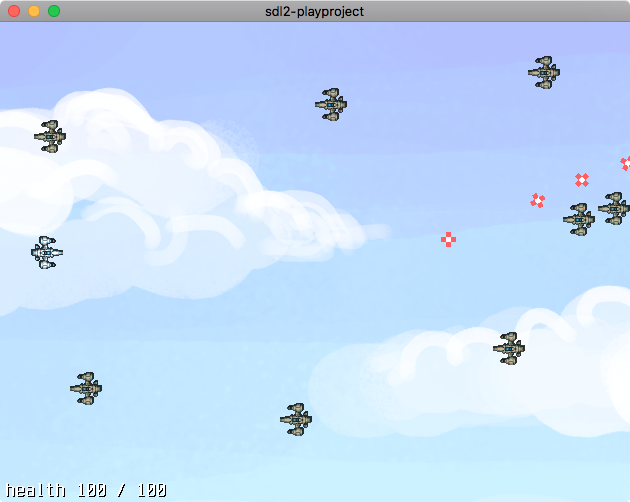
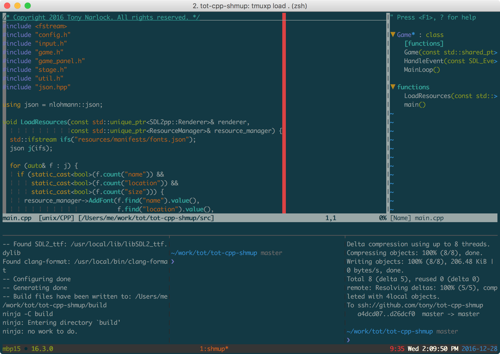

# Tony's C++ Mini Game

C++ + CMake + SDL2 shooter minigame for [*The Tao of tmux and Terminal Tricks*](https://leanpub.com/the-tao-of-tmux/read)

# Features

* [`Makefile`](https://en.wikipedia.org/wiki/Makefile) with [file watching functionality from the
  book](https://leanpub.com/the-tao-of-tmux/read#leanpub-auto-file-watching)

  * `make debug` - generate game with debug symbols for lldb
  * `make watch_debug` - rebuild debug application on code file change
  * `make build` - generate game app
  * `make watch_build` - rebuild build application on code file change
  * `make run` - open game

    

* Load project with [tmuxp](https://tmuxp.git-pull.com) via `$ tmuxp load .` in
  the project directory.

  

# Dependencies

Clone with

`git clone --recursive https://github.com/tony/tot-cpp-shmup.git`

If you forgot to type `--recursive` download submodules with:

`git submodule update --init --recursive`

### MacOS

`$ make install_osx_deps`

or

`$ brew install cmake ninja sdl2 sdl2_image sdl2_ttf entr`

### Linux

Debian / Ubuntu / Mint: `$ sudo apt-get install ninja-build cmake libsdl2-dev entr`

# Building

`$ make debug`

# Running

`$ make run`
